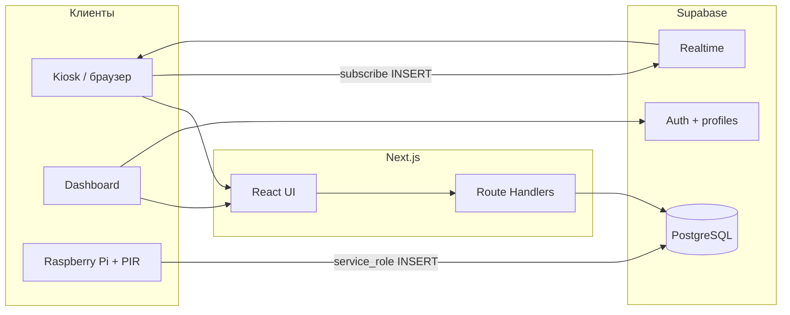

> **Языки / Languages:** [English](./README.md) · [Русский](./README.ru.md)

# Smart Bus Stop System

Веб-платформа для умной остановки: киоск для пассажиров, операторская панель, симуляция движения автобусов по GTFS (Астана, маршруты 10 / 12 / 46), голосовые и текстовые запросы к AI, оповещения и пробуждение экрана по датчику движения на Raspberry Pi.

**Стек:** Next.js 16 (App Router), React 19, TypeScript, Tailwind CSS, Supabase (PostgreSQL, Auth, Realtime), Leaflet, Vercel AI SDK.

---

## Возможности

| Область | Описание |
|--------|----------|
| **Киоск** (`/kiosk`) | ETA, карта, активные алерты, выбор остановки, idle-оверлей, подписка на `kiosk_events` (пробуждение по движению) |
| **Панель** (`/dashboard`) | Карта транспорта, маршруты, остановки, флот, метрики, AI-запросы, управление алертами (роли admin / operator) |
| **API** | `/api/eta`, `/api/vehicles`, `/api/map/transit`, `/api/ai/question`, CRUD алертов для dashboard |
| **i18n** | Казахский (по умолчанию), русский, английский — cookie `locale` |
| **Данные** | GTFS static → схема `gtfs` → проекция в `bus_*`; в dev часть логики опирается на mock/simulation |

---

## Архитектура (упрощённо)



- **Пассажирский киоск** читает остановки, ETA и алерты через anon key; запись в `ai_query_logs` разрешена публично.
- **Dashboard** требует входа; роль в `profiles` (`admin` | `operator` | `viewer`) управляет правами на изменение данных и алертов.
- **Pi-демон** пишет в `kiosk_events` с `service_role`; киоск подписывается на Realtime и снимает idle-режим.

---

## Быстрый старт (локально)

### Требования

- Node.js 20+
- npm (или pnpm)
- Проект [Supabase](https://supabase.com/)

### 1. Клонирование и зависимости

```bash
git clone <your-repo-url> bus-stop-system-architecture
cd bus-stop-system-architecture
npm ci
```

### 2. Переменные окружения

Создайте `.env.local` в корне репозитория:

```dotenv
# Обязательно для приложения
NEXT_PUBLIC_SUPABASE_URL=https://YOUR_PROJECT.supabase.co
NEXT_PUBLIC_SUPABASE_ANON_KEY=your_anon_key

# Идентификатор физического киоска (Pi и UI должны совпадать)
NEXT_PUBLIC_KIOSK_ID=demo

# Только на сервере — импорт GTFS, Pi, админские задачи. НЕ попадает в браузер.
SUPABASE_SERVICE_ROLE_KEY=your_service_role_key

# Опционально: тест dev с телефона/планшета по IP (через запятую)
ALLOWED_DEV_ORIGINS=192.168.1.100

# Опционально: AI-ответы (/api/ai/question), модель openai/gpt-4o-mini
OPENAI_API_KEY=sk-...
```

| Переменная | Где используется |
|------------|------------------|
| `NEXT_PUBLIC_SUPABASE_*` | Клиент и серверные Supabase-клиенты |
| `NEXT_PUBLIC_KIOSK_ID` | `KioskShell`, фильтр событий Realtime |
| `SUPABASE_SERVICE_ROLE_KEY` | `tools/import-gtfs.mjs`, Pi (`/etc/kiosk-motion.env`) |
| `ALLOWED_DEV_ORIGINS` | `next.config.mjs` → `allowedDevOrigins` |
| `OPENAI_API_KEY` | Vercel AI SDK в `/api/ai/question` (без ключа — fallback-ответы) |

### 3. База данных Supabase

Выполните SQL **по порядку** в [SQL Editor](https://supabase.com/dashboard) (или через `supabase db push` для файлов из `supabase/migrations/`):

| Шаг | Файл | Назначение |
|-----|------|------------|
| 1 | `scripts/001_create_bus_system_schema.sql` | Таблицы `bus_*`, `alerts`, `profiles`, RLS, Realtime |
| 2 | `scripts/002_seed_sample_data.sql` | Демо-данные (опционально) |
| 3 | `scripts/003_create_gtfs_staging.sql` | Схема `gtfs` для импорта |
| 4 | `scripts/004_project_gtfs_to_bus_schema.sql` | Проекция GTFS → `bus_stops`, маршруты |
| 5 | `supabase/migrations/*.sql` | `kiosk_events`, переводы остановок, RPC алертов |
| 6 | `scripts/setup-kiosk-alerts.sql` | Политики + `save_kiosk_alert` / `delete_kiosk_alert` (если миграции не применялись) |

После регистрации пользователя назначьте роль admin:

```sql
update public.profiles
set role = 'admin'
where id = (select id from auth.users where email = 'your@email.com');
```

### 4. Импорт GTFS (опционально)

Положите архив GTFS в корень (по умолчанию `gtfs_static_mvp_10_12_46.zip`) или укажите путь:

```bash
# В .env.local должен быть SUPABASE_SERVICE_ROLE_KEY
npm run gtfs:import
```

Переменные для импорта: `GTFS_ZIP_PATH`, `GTFS_FEED_ID` (по умолчанию `astana`).

Генерация TS-переводов остановок из CSV:

```bash
npm run i18n:stops
```

### 5. Запуск

```bash
npm run dev
```

- Главная: http://localhost:3000
- Киоск: http://localhost:3000/kiosk
- Вход в панель: http://localhost:3000/auth/login → `/dashboard`

Доступ с других устройств в локальной сети:

```bash
npm run dev:public
# слушает 0.0.0.0:3001
```

---

## Роли и доступ

| Роль | Dashboard | Алерты: создать/редактировать | Алерты: удалить |
|------|-----------|-------------------------------|-----------------|
| `viewer` | Просмотр | — | — |
| `operator` | Просмотр + часть правок | Да | — |
| `admin` | Полный доступ | Да | Да |

Логика ролей: `lib/auth/dashboard-role.ts`. RPC `save_kiosk_alert` / `delete_kiosk_alert` дублируют проверки на уровне БД (`security definer`).

---

## Основные маршруты приложения

| Путь | Описание |
|------|----------|
| `/` | Лендинг |
| `/kiosk` | UI киоска |
| `/auth/login` | Supabase Auth |
| `/dashboard` | Обзор |
| `/dashboard/map` | Карта маршрутов и ТС |
| `/dashboard/alerts` | Управление оповещениями |
| `/dashboard/routes`, `/stops`, `/fleet`, `/metrics`, `/queries`, `/settings` | Разделы оператора |

### API

| Endpoint | Назначение |
|----------|------------|
| `GET /api/eta?stopId=...` | ETA для остановки |
| `GET /api/vehicles` | Позиции / симуляция ТС |
| `GET /api/map/transit` | Данные для карты |
| `POST /api/ai/question` | Вопрос к AI (логи в `ai_query_logs`) |
| `GET/POST /api/dashboard/alerts` | Алерты (сессия + роль) |
| `DELETE /api/dashboard/alerts/[id]` | Удаление (только admin) |
| `POST /api/dev/simulation-speed` | Только `NODE_ENV=development` |

---

## Raspberry Pi: пробуждение киоска по движению

Датчик PIR (например HC-SR501) → GPIO → скрипт вставляет строку в `kiosk_events` → киоск по Realtime выходит из idle.

На Pi (Linux):

```bash
bash scripts/raspberry-pi/install-on-pi.sh
sudo cp scripts/raspberry-pi/kiosk-motion.env.example /etc/kiosk-motion.env
sudo chmod 600 /etc/kiosk-motion.env
# заполнить SUPABASE_URL, SUPABASE_SERVICE_ROLE_KEY, KIOSK_ID
python3 /opt/kiosk-motion/motion_gpio_test.py
sudo systemctl enable --now motion-kiosk-wake.service
```

`KIOSK_ID` в `/etc/kiosk-motion.env` должен совпадать с `NEXT_PUBLIC_KIOSK_ID` в `.env.local` / staging.

Миграция таблицы: `supabase/migrations/20260511120000_kiosk_events.sql`.

---

## Staging / production на сервере

Подробная инструкция: **[STAGING.md](./STAGING.md)** (Nginx, HTTPS, systemd, чеклист multi-device).

Кратко:

```bash
npm run build
npm run start:public   # :3001, 0.0.0.0
```

Файлы деплоя: `deploy/nginx.staging.conf`, `deploy/bus-stop-staging.service`.

На Windows для автоперезапуска можно использовать PM2: `ecosystem.config.cjs` (пути подставьте под свою машину).

---

## Структура репозитория

```
app/                    # Next.js App Router (страницы, API)
components/             # UI: kiosk, dashboard, shadcn
lib/                    # Supabase, vehicles/simulation, i18n, alerts
hooks/
scripts/                # SQL-схема, seed, setup-kiosk-alerts.sql
scripts/raspberry-pi/   # motion wake daemon
supabase/migrations/    # Версионированные миграции
tools/                  # import-gtfs.mjs, generate-stop-translations
gtfs_static_mvp_10_12_46/  # Распакованный GTFS MVP (маршруты 10, 12, 46)
deploy/                 # Nginx + systemd для staging
```

---

## npm-скрипты

| Команда | Действие |
|---------|----------|
| `npm run dev` | Dev-сервер :3000 |
| `npm run dev:public` | Dev на `0.0.0.0:3001` |
| `npm run build` | Production build |
| `npm run start` / `start:public` | Production server |
| `npm run staging` | `build` + `start:public` |
| `npm run lint` | ESLint |
| `npm run gtfs:import` | Импорт GTFS в Supabase |
| `npm run i18n:stops` | Генерация переводов остановок |

---

## Безопасность

- **Никогда** не коммитьте `.env.local`, `/etc/kiosk-motion.env` и `service_role` key.
- `SUPABASE_SERVICE_ROLE_KEY` обходит RLS — только сервер и Pi.
- Anon key безопасен для браузера при корректных RLS-политиках.
- Публичное чтение транзитных таблиц и алертов заложено в схему для киоска; запись в справочники — только authenticated с ролью.

---

## Разработка и отладка

- Симуляция автобусов и ETA: `lib/vehicles/` (mock Astana, overrides для маршрутов 10/12/46).
- В development доступна настройка скорости симуляции через `/api/dev/simulation-speed`.
- Для доступа к dev с IP другого устройства добавьте хост в `ALLOWED_DEV_ORIGINS` или в `allowedDevOrigins` в `next.config.mjs`.
- Сессия Supabase обновляется через `proxy.ts` → `lib/supabase/update-session.ts` (middleware matcher).

---

## Лицензия и вклад

Приватный проект (`"private": true` в `package.json`). Перед PR: `npm run lint`, проверьте миграции Supabase и не включайте секреты в diff.

---

## См. также

- [STAGING.md](./STAGING.md) — домен, HTTPS, systemd, чеклист киоска
- `scripts/setup-kiosk-alerts.sql` — одноразовая настройка RPC и политик алертов в SQL Editor
- `scripts/raspberry-pi/kiosk-motion.env.example` — шаблон env для Pi
